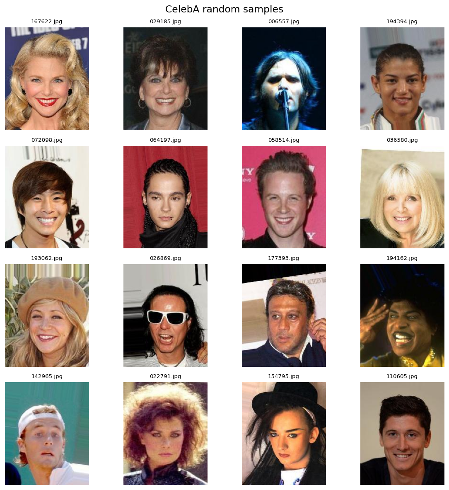
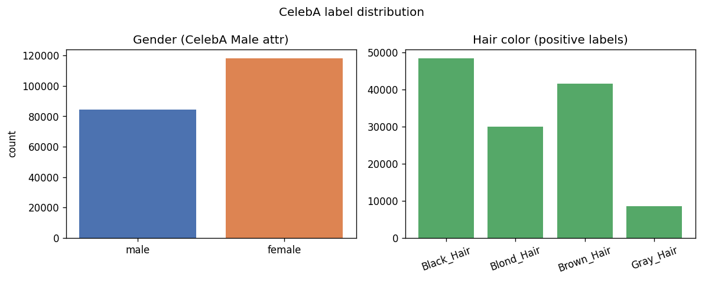
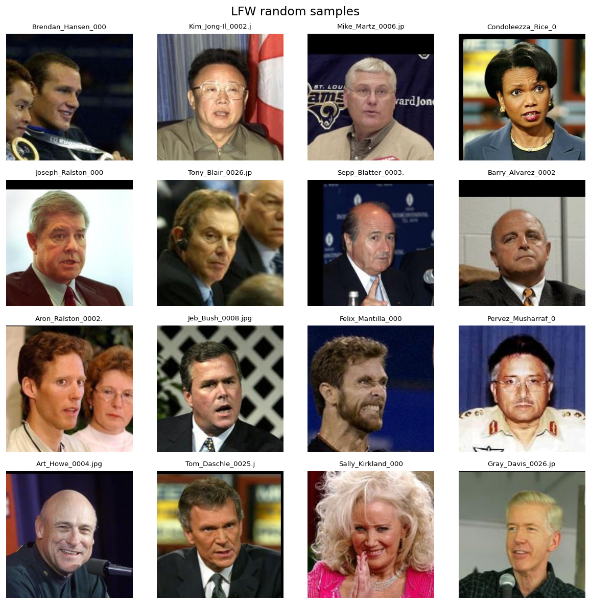

# 数据集分析报告

- 生成时间: 2026-05-15 17:12:09
- 数据根目录: `/Users/apple/Projects/data`

## 1. 数据概览

### CelebA

| 指标 | 数值 |
|------|------|
| 图片数量 | 202,599 |
| attribute_file | /Users/apple/Projects/data/celeba/list_attr_celeba.txt |

### LFW

| 指标 | 数值 |
|------|------|
| 图片数量 | 4,857 |
| 身份/人数 | 1,680 |
| identities | 1680 |
| min_images_per_person | 1 |
| max_images_per_person | 265 |
| avg_images_per_person | 2.89 |
| note | LFW 官方包不含发色/性别标签；标签分布仅对 CelebA 统计。 |

## 2. CelebA 标签分布

### 性别比例

- 男性 (Male=1): 84,434 (41.68%)
- 女性 (Male=-1): 118,165 (58.32%)

### 发色标签（多标签，可重叠）

- Black_Hair: 48,472 (23.93%)
- Blond_Hair: 29,983 (14.8%)
- Brown_Hair: 41,572 (20.52%)
- Gray_Hair: 8,499 (4.19%)
- 无发色正标签: 77,003
- 有属性标注的图片数: 202,599

## 3. LFW 说明

LFW 按人物文件夹组织。官方发布包不包含发色/性别属性文件，
本报告对 LFW 仅统计图片数与每人图片数分布。

## 4. 可视化图表







## 5. 目录结构建议

```text
../data/
  celeba/
    img_align_celeba/
    list_attr_celeba.txt
  lfw/
    lfw/<person_name>/*.jpg
```

项目内 `samples/` 存放 10–20 张抽样图，完整数据通过 Docker volume 挂载 `../data`。
