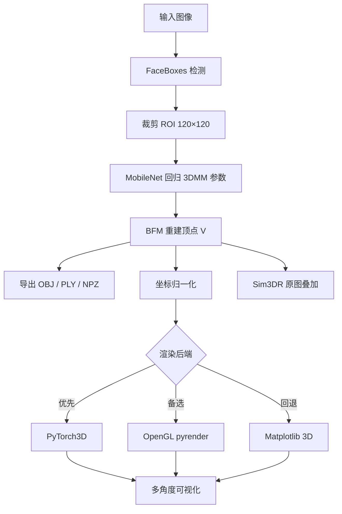

# Stage 3：单张图像 3D 人脸重建 — 思路设计

## 1. 问题定义

**输入**：单张 RGB 人脸图像（可含背景）。  
**输出**：与图像一致的稠密 3D 人脸网格（顶点 + 三角面），以及多角度渲染图、姿态与质量分析。

## 2. 算法对比与选型

| 方法 | 优点 | 缺点 | 本项目 |
|------|------|------|--------|
| **PRNet** | 端到端 UV 位置图，实现直观 | 需单独权重与解码，维护成本较高 | 未采用（可作为扩展） |
| **3DDFA_V2** | 官方 PyTorch、ONNX 加速、BFM 稠密 mesh、文档完善 | 依赖 BFM 子空间，纹理为顶点采样 | **主方案** |

选用 **3DDFA_V2**：在 CPU/GPU 上回归 62 维 3DMM 系数，经 BFM 生成约 **38,365** 个稠密顶点，满足课程/工程对「单图 3D 重建」的交付要求。

## 3. 流水线设计



### 3.1 3DMM 参数

3DDFA 预测向量经均值/方差反归一化后解析为：

- 旋转 \(R\) 与平移（相机位姿）
- 形状系数 \(\alpha_{shp}\)、表情系数 \(\alpha_{exp}\)

稠密顶点：

\[
V = R \cdot (u + W_{shp}\alpha_{shp} + W_{exp}\alpha_{exp}) + t
\]

再映射回原图像素坐标系。

### 3.2 渲染策略

1. **PyTorch3D**：可微渲染、GPU 友好，适合与后续学习任务衔接。  
2. **OpenGL (pyrender)**：经典光栅化，效果接近真实场景。  
3. **Matplotlib**：无额外编译依赖，保证流水线在任何环境可跑通。

`render_dispatch.py` 按 `auto` 顺序尝试上述后端。

### 3.3 多角度可视化

在归一化 mesh 上，绕 Y 轴采样方位角（默认 12 个：0°–330°，步长 30°），固定俯仰角 15°，生成单视角 PNG 并合成网格图 `outputs/multiview/`。

## 4. 目录与交付物

```text
stage3_3dFace/
├── configs/pipeline.json      # 超参与路径
├── src/                       # 重建与渲染封装
├── scripts/                   # 一键脚本
├── third_party/3DDFA_V2/      # 上游实现（含权重）
├── data/samples/              # 测试图像
├── outputs/
│   ├── meshes/                # .obj / .ply / .npz
│   ├── renders/               # 单视角 + 叠加
│   └── multiview/             # 多角度合成
└── reports/
    ├── design.md              # 本文档
    ├── experiment_report.md   # 自动生成实验报告
    └── figures/               # 分析图表
```

## 5. 局限与改进

- **身份与纹理**：3DMM 难以恢复牙齿、头发等高频细节；可接 DECA/HRN 等纹理模块。  
- **多人脸**：当前默认取第一张脸，可扩展为多 mesh 导出。  
- **PRNet**：若需 UV 纹理贴图，可并行增加 PRNet 分支作对比实验。
