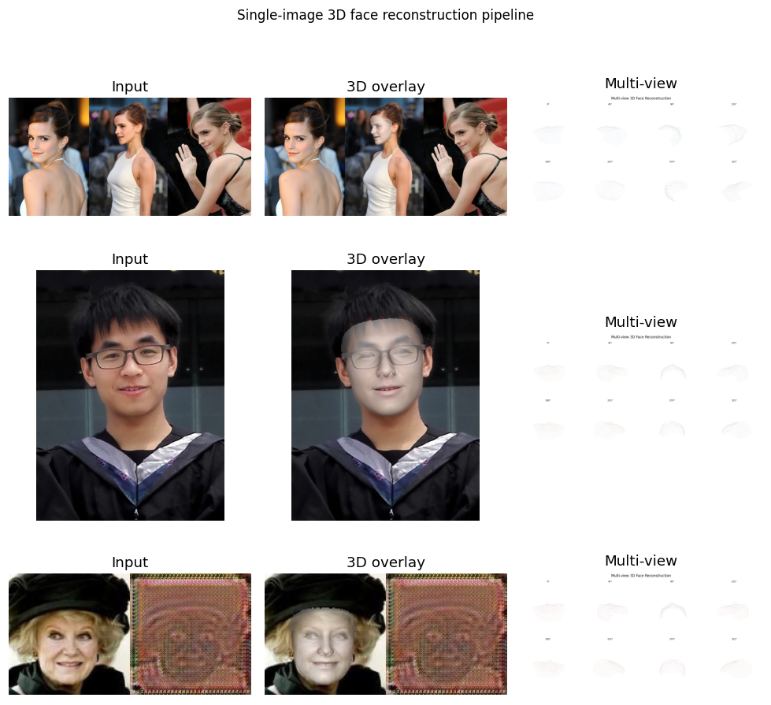
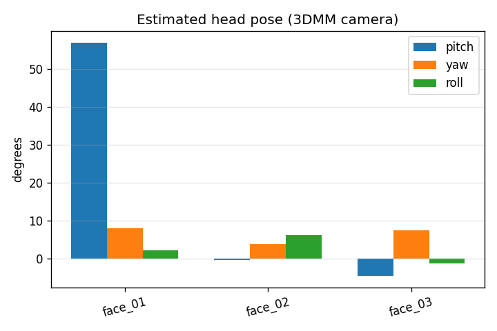
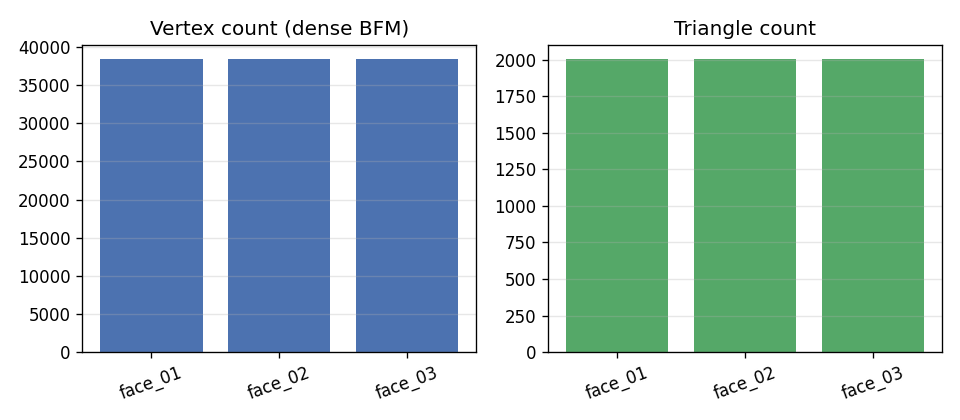

# Stage 3：单张图像 3D 人脸重建实验报告

## 1. 任务与目标

从单张 RGB 人脸图像估计 **3D Morphable Model (3DMM)** 参数，重建稠密 3D 人脸网格，
并使用 **PyTorch3D / OpenGL (pyrender) / Matplotlib** 进行多角度渲染与可视化分析。

## 2. 算法选型

| 模块 | 方案 | 说明 |
|------|------|------|
| 3D 重建 | **3DDFA_V2** (ECCV 2020) | 回归 62 维 3DMM 参数，BFM 稠密顶点 (~38k) |
| 人脸检测 | FaceBoxes + ONNX | 与 3DDFA 官方实现一致 |
| 渲染 | 自动选择后端 | 优先 PyTorch3D，其次 OpenGL，回退 Matplotlib |

本次运行渲染后端：**matplotlib**

## 3. 重建结果摘要

| 样本 | 顶点数 | 三角面数 | Pitch° | Yaw° | Roll° |
|------|--------|----------|--------|------|-------|
| face_01 | 38365 | 2002 | 56.9 | 7.9 | 2.0 |
| face_02 | 38365 | 2002 | -0.5 | 3.7 | 6.1 |
| face_03 | 38365 | 2002 | -4.7 | 7.5 | -1.3 |

## 4. 可视化

### 4.1 输入 / 叠加 / 多角度

### 4.2 姿态估计

### 4.3 网格规模

## 5. 输出目录

| 路径 | 内容 |
|------|------|
| `outputs/meshes/*.obj` | 带纹理顶点色的 OBJ 模型 |
| `outputs/meshes/*.ply` | PLY 点云/网格 |
| `outputs/renders/<stem>/` | 单视角渲染与 3DDFA 叠加图 |
| `outputs/multiview/` | 12 视角合成图 |

## 6. 结论

3DDFA_V2 可在单张图像上快速得到与 BFM 对齐的稠密 3D 人脸；
结合参数化姿态可解释地控制多角度渲染。
纹理细节受限于 3DMM 子空间，极端姿态或遮挡时误差增大。
