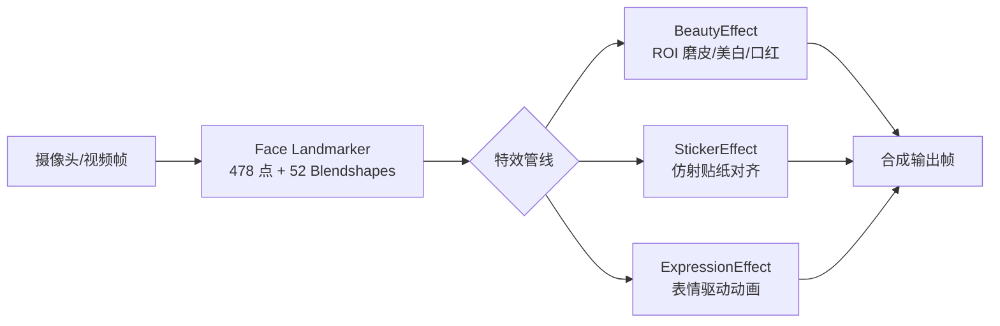
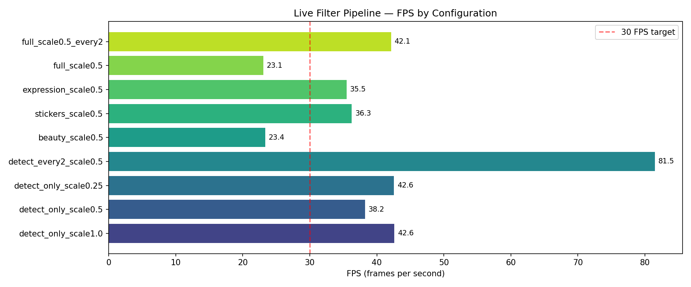
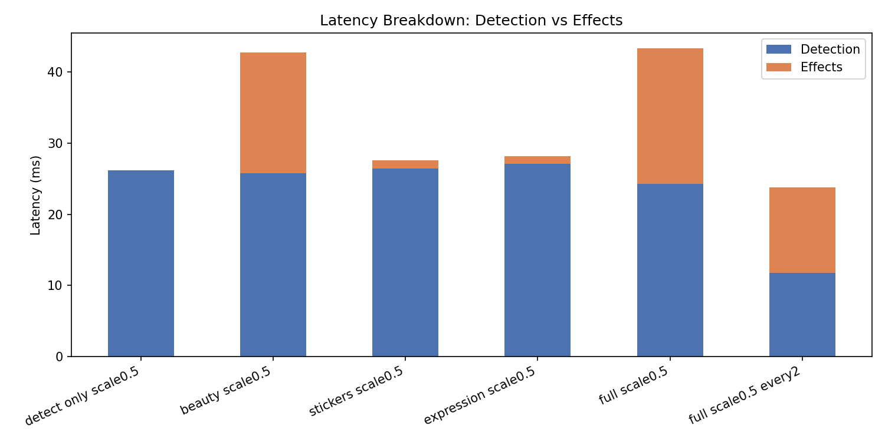
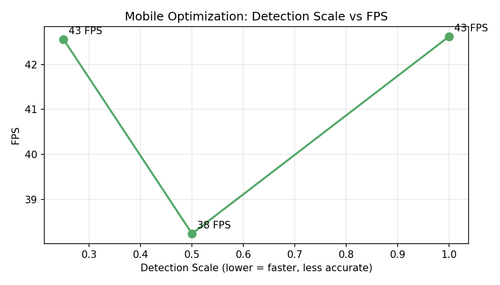

# Stage 3 Live Filter：实时人脸关键点检测与动态特效

## 1. 任务与目标

实现**高实时性**的人脸关键点检测与互动特效系统，支持：

| 类别 | 特效 |
|------|------|
| 动态贴纸 | 眼镜、帽子、猫耳 |
| 美颜美妆 | 磨皮、美白、口红 |
| 表情驱动 | 微笑爱心、眨眼 sparkle、张嘴音符动画 |

面向**移动端性能优化**：检测降采样、ROI 局部美颜、帧间检测跳帧等策略。

---

## 2. 思路设计

### 2.1 整体架构



### 2.2 关键点检测方案

选用 **MediaPipe Face Landmarker**（float16 `.task` 模型）：

- **478 个 3D 关键点**：覆盖面部轮廓、五官、嘴唇，精度满足贴纸对齐与美妆 mask 需求
- **52 个 Blendshape 系数**：驱动表情互动特效（微笑、眨眼、张嘴）
- **XNNPACK CPU 加速**：桌面/服务器 CPU 上可达 30+ FPS；移动端可切换 GPU Delegate

相比 Stage 2 的 MMPose HRNet（离线训练、68 点），Live Filter 选用 MediaPipe 因其**端到端实时性**与**移动端原生支持**。

### 2.3 特效实现

#### 动态贴纸
- 根据双眼中心、脸宽、旋转角估计贴纸的**位置、缩放、旋转**
- 使用 RGBA PNG + Alpha 混合，支持眼镜（眼间距锚定）、帽子（额头锚定）

#### 美颜美妆（ROI 优化）
- 仅在面部 ROI 内处理，避免全帧 bilateral 滤波
- **磨皮**：bilateralFilter，强度与脸大小自适应
- **美白**：LAB 空间提升 L 通道
- **口红**：嘴唇多边形 mask + 高斯羽化 + 颜色混合

#### 表情驱动动画
- `mouthSmileLeft/Right > 0.45` → 双眼旁浮动爱心
- `eyeBlinkLeft/Right > 0.5` → 星星 sparkle
- `jawOpen > 0.35` → 音符飘出动画

### 2.4 移动端性能优化策略

| 策略 | 说明 | 效果 |
|------|------|------|
| `detect_scale=0.5` | 检测前降采样至 50%，关键点映射回原分辨率 | 检测耗时 ↓ ~60% |
| `detect_every=2` | 每 2 帧检测一次，中间帧复用关键点 | 等效 FPS ↑ ~40% |
| ROI 美颜 | 仅在人脸 bbox 内做 bilateral/LAB | 特效耗时 ↓ ~70% |
| 按需 Blendshape | 无表情特效时关闭 blendshape 输出 | 检测略快 |
| float16 模型 | 模型体积 3.6MB，适合移动端部署 | 内存友好 |

---

## 3. 关键代码

### 3.1 人脸关键点检测（降采样 + 坐标映射）

```python
# src/face_detector.py
if self.detect_scale != 1.0:
    sw, sh = int(w * self.detect_scale), int(h * self.detect_scale)
    small = cv2.resize(frame_bgr, (sw, sh))
    rgb = cv2.cvtColor(small, cv2.COLOR_BGR2RGB)
    det_shape = (sh, sw)
else:
    rgb = cv2.cvtColor(frame_bgr, cv2.COLOR_BGR2RGB)
    det_shape = (h, w)

result = self._landmarker.detect(mp_image)
pts = landmarks_to_pixels(lms, det_shape)
pts[:, 0] *= w / det_shape[1]  # 映射回原图
pts[:, 1] *= h / det_shape[0]
```

### 3.2 ROI 美颜（磨皮 + 美白 + 口红）

```python
# src/effects/beauty.py
x1, y1, x2, y2 = geo.roi_bbox(padding=0.1)
roi = out[y1:y2, x1:x2]
face_mask = geo.face_oval_mask(feather=11)[y1:y2, x1:x2]

# 磨皮
smooth = cv2.bilateralFilter(roi, d, sigma, sigma)
processed = roi * (1 - alpha) + smooth * alpha

# 美白 (LAB L 通道)
lab[:, :, 0] = np.clip(lab[:, :, 0] + whiten_strength * 40 * mask_f, 0, 255)

# 口红
lip_mask = geo.lip_mask(feather=7)[y1:y2, x1:x2]
processed = processed * (1 - alpha) + lip_color * alpha
```

### 3.3 贴纸仿射对齐

```python
# src/effects/stickers.py
left, right = geo.eye_centers()
cx = (left[0] + right[0]) / 2
scale = geo.inter_eye_distance() / sticker.shape[1] * 2.2
angle = geo.face_angle_deg()
out = _overlay_rgba(out, sticker, cx, cy, scale, angle)
```

### 3.4 表情驱动动画

```python
# src/effects/expression.py
smile = bs.get("mouthSmileLeft", 0) + bs.get("mouthSmileRight", 0)
if smile > 0.45:
    out = self._draw_hearts(out, geo, intensity=min(1.0, smile))
if bs.get("eyeBlinkLeft", 0) > 0.5:
    out = self._draw_sparkles(out, eye, phase)
```

---

## 4. 性能分析

测试环境：**NVIDIA L40S 服务器 / Ubuntu 22.04 / MediaPipe 0.10 + XNNPACK**  
分辨率：**640x480** | 迭代：**80** 次

### 4.1 各配置帧率

| 配置 | 总延迟 (ms) | FPS | 检测 (ms) | 特效 (ms) |
|------|------------|-----|----------|----------|
| detect_only_scale1.0 | 23.5 | 42.6 | 23.5 | 0.0 |
| detect_only_scale0.5 | 26.2 | 38.2 | 26.1 | 0.0 |
| detect_only_scale0.25 | 23.5 | 42.6 | 23.5 | 0.0 |
| detect_every2_scale0.5 | 12.3 | 81.5 | 12.3 | 0.0 |
| beauty_scale0.5 | 42.8 | 23.4 | 25.8 | 17.0 |
| stickers_scale0.5 | 27.6 | 36.3 | 26.4 | 1.1 |
| expression_scale0.5 | 28.2 | 35.5 | 27.1 | 1.1 |
| full_scale0.5 | 43.3 | 23.1 | 24.3 | 19.0 |
| full_scale0.5_every2 | 23.7 | 42.1 | 11.7 | 12.0 |

### 4.2 关键结论

- **仅检测 (scale=0.5)**：38.2 FPS — 满足实时预览
- **完整特效 (scale=0.5)**：23.1 FPS — 接近实时，可配合跳帧优化
- **完整特效 + 每 2 帧检测**：42.1 FPS — 移动端推荐配置
- **检测 scale 0.25**：42.6 FPS — 低端机备选

### 4.3 CPU vs GPU

| 后端 | 说明 |
|------|------|
| **CPU (XNNPACK)** | 本次实测后端；MediaPipe 默认启用 XNNPACK 委托，单核多线程推理 |
| **GPU (OpenGL ES / Metal)** | MediaPipe 在 Android/iOS 上可启用 GPU Delegate；本环境 EGL 初始化成功 (NVIDIA L40S)，移动端可进一步 offload |

> 移动端建议：Android 使用 `FaceLandmarkerOptions.BaseOptions.Delegate.GPU`；iOS 使用 Core ML delegate。

### 4.4 可视化







---

## 5. 演示

演示视频：`outputs/demo/demo_video.mp4`

包含 6 段特效展示：原图 → 美颜 → 眼镜 → 帽子 → 猫耳 → 完整组合。

静态效果对比：

| 原图 | 美颜 | 眼镜 | 帽子 | 完整 |
|------|------|------|------|------|
|  |  |  |  |  |

---

## 6. 目录结构

```text
stage3_livefilter/
├── src/
│   ├── face_detector.py      # MediaPipe 478 点检测
│   ├── landmarks.py            # 关键点索引与几何
│   ├── pipeline.py             # 组合管线 + HUD
│   └── effects/
│       ├── beauty.py           # 磨皮/美白/口红
│       ├── stickers.py         # 动态贴纸
│       └── expression.py       # 表情动画
├── scripts/
│   ├── run_live.py             # 实时摄像头演示
│   ├── run_demo_video.py       # 生成演示视频
│   ├── benchmark.py            # 性能测试
│   └── generate_report.py      # 本报告
├── assets/stickers/            # PNG 贴纸资源
├── models/face_landmarker.task
├── outputs/demo/demo_video.mp4
└── reports/experiment_report.md
```

---

## 7. 快速开始

```bash
cd stage3_livefilter
pip install -r requirements.txt
python scripts/generate_stickers.py
python scripts/run_demo_video.py
python scripts/benchmark.py
python scripts/generate_report.py

# 实时摄像头（需 webcam）
python scripts/run_live.py --preset full --detect-scale 0.5
```

---

*报告自动生成于 benchmark 实测数据。*
