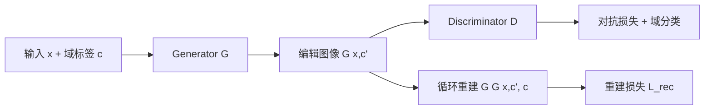
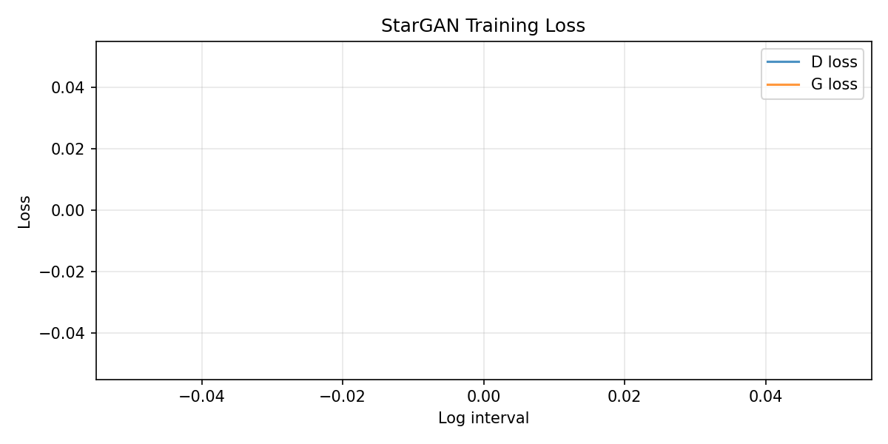

# Stage 3：StarGAN 人脸属性编辑实验报告

## 1. 任务与目标

在 **CelebA** 数据集上训练 **StarGAN v1**，实现单模型多域（multi-domain）人脸属性翻译，支持：

| 属性 | 含义 |
|------|------|
| Black_Hair | 黑发 |
| Blond_Hair | 金发 |
| Brown_Hair | 棕发 |
| Male | 性别（男/女） |
| Young | 年龄（年轻/年长） |

训练完成后对生成图像进行 **FID**、**Inception Score (IS)** 评估，并输出属性编辑可视化结果。

---

## 2. 思路设计

### 2.1 StarGAN 架构

StarGAN 使用单一生成器 `G(x, c)` 与判别器 `D(x)`：

- **生成器**：将域标签向量 `c`（5 维二值）在通道维拼接到输入图像，经编码器–残差块–解码器输出编辑后人脸。
- **判别器**：PatchGAN 结构，同时输出真假判别图与域分类 logits，实现对抗训练 + 域分类约束。
- **循环一致性**：`x → G(x,c') → G(·,c) ≈ x`，权重 λ_rec=10，保持身份与结构。

### 2.2 损失函数

```
L_D = -E[log D(x)] + E[log D(G(x,c'))] + λ_gp·GP + λ_cls·L_cls
L_G = -E[log D(G(x,c'))] + λ_cls·L_cls^G + λ_rec·||x - G(G(x,c'),c)||₁
```

### 2.3 数据与训练配置

- 图像：128×128，对齐 CelebA
- 训练集：partition 0/1（约 162k）；验证集：partition 2
- 训练：**3 epoch**，batch=16，Adam lr=2e-05



---

## 3. 关键代码

### 3.1 生成器（标签拼接 + 残差块）

```python

    def __init__(self, conv_dim=64, c_dim=5, repeat_num=6):
        super().__init__()
        layers = [
            nn.Conv2d(3 + c_dim, conv_dim, 7, 1, 3, bias=False),
            nn.InstanceNorm2d(conv_dim, affine=True),
            nn.ReLU(inplace=True),
        ]
        curr = conv_dim
        for _ in range(2):
            layers += [
                nn.Conv2d(curr, curr * 2, 4, 2, 1, bias=False),
                nn.InstanceNorm2d(curr * 2, affine=True),
                nn.ReLU(inplace=True),
            ]
            curr *= 2
        for _ in range(repeat_num):
            layers.append(ResidualBlock(curr))
        for _ in range(2):
            layers += [
                nn.ConvTranspose2d(curr, curr // 2, 4, 2, 1, bias=False),
                nn.InstanceNorm2d(curr // 2, affine=True),
                nn.ReLU(inplace=True),
            ]
            curr //= 2
        layers += [nn.Conv2d(curr, 3, 7, 1, 3), nn.Tanh()]
        self.main = nn.Sequential(*layers)

    def forward(self, x, c):
        c = c.view(c.size(0), c.size(1), 1, 1).expand(-1, -1, x.size(2), x.size(3))
        return self.main(torch.cat([x, c], dim=1))


```

### 3.2 CelebA 属性加载

```python
    """Loads img_align_celeba with selected binary attributes (-1/1 -> 0/1)."""

    def __init__(self, root, attr_path, selected_attrs, transform, partition="train"):
        self.root = Path(root)
        self.img_dir = self.root / "img_align_celeba"
        self.transform = transform
        self.selected_attrs = selected_attrs
        self.partition = partition

        with open(attr_path, "r", encoding="utf-8") as f:
            lines = [ln.strip() for ln in f.readlines()]
        num_images = int(lines[0])
        attr_names = lines[1].split()
        self.attr2idx = {name: i for i, name in enumerate(attr_names)}

        indices = [self.attr2idx[a] for a in selected_attrs]
        partition_path = self.root / "list_eval_partition.txt"
        part_map = {}
        if partition_path.exists():
            with open(partition_path, "r", encoding="utf-8") as f:
                for ln in f:
                    name, part = ln.strip().split()
                    part_map[name] = int(part)

        self.samples = []
        for ln in lines[2:]:
            parts = ln.split()
            if len(parts) < len(attr_names) + 1:
                continue
            fname = parts[0]
            attrs_raw = [int(x) for x in parts[1:]]
            attrs = [(attrs_raw[i] + 1) // 2 for i in indices]

            if partition_path.exists():
                part = part_map.get(fname, 0)
                if partition == "train" and part == 2:
                    continue
                if partition == "val" and part != 2:
                    continue
            self.samples.append((fname, attrs))

        if not partition_path.exists() and partition == "val":
            n = len(self.samples)
            self.samples = self.samples[int(0.95 * n):]
        elif not partition_path.exists() and partition == "train":
```

### 3.3 训练一步（对抗 + 分类 + 重建）

```python
                state_path = Path(self.cfg["checkpoint_dir"]) / f"{iters}-state.pth"
                if state_path.exists():
                    state = torch.load(state_path, map_location=self.device, weights_only=False)
                    self.g_opt.load_state_dict(state["g_opt"])
                    self.d_opt.load_state_dict(state["d_opt"])
                    self.history = state.get("history", self.history)
            print(f"Restored G from {ckpt}" + (" (G only)" if g_only else ""), flush=True)

    def save(self, iters):
        ckpt_dir = Path(self.cfg["checkpoint_dir"])
        torch.save(self.G.state_dict(), ckpt_dir / f"{iters}-G.pth")
        torch.save(self.D.state_dict(), ckpt_dir / f"{iters}-D.pth")
        torch.save(
            {"g_opt": self.g_opt.state_dict(), "d_opt": self.d_opt.state_dict(), "history": self.history},
            ckpt_dir / f"{iters}-state.pth",
        )
        (ckpt_dir / "latest.txt").write_text(str(iters), encoding="utf-8")

    def save_best(self, iters, d_loss):
        if d_loss < self.best_d_loss:
            self.best_d_loss = d_loss
            ckpt_dir = Path(self.cfg["checkpoint_dir"])
            for src_suffix, dst_suffix in (("-G.pth", "-G-best.pth"), ("-D.pth", "-D-best.pth")):
                src = ckpt_dir / f"{iters}{src_suffix}"
                dst = ckpt_dir / dst_suffix
                if src.exists():
                    dst.write_bytes(src.read_bytes())
            print(f"New best checkpoint (D={d_loss:.2f}) saved @ iter {iters}", flush=True)

    def _prune_old_checkpoints(self, keep=5):
        ckpt_dir = Path(self.cfg["checkpoint_dir"])
        tags = sorted({int(p.stem.split("-")[0]) for p in ckpt_dir.glob("*-G.pth")})
        for tag in tags[:-keep]:
            for suffix in ("-G.pth", "-D.pth", "-state.pth"):
                p = ckpt_dir / f"{tag}{suffix}"
                if p.exists():
                    p.unlink()

    def gradient_penalty(self, y_real, y_fake):
        batch = y_real.size(0)
        eps = torch.rand(batch, 1, 1, 1, device=self.device)
        interp = (eps * y_real + (1 - eps) * y_fake).requires_grad_(True)
        out_src, _ = self.D(interp)
        grad = torch.autograd.grad(
            outputs=out_src.sum(),
            inputs=interp,
            create_graph=True,
            retain_graph=True,
        )[0]
        grad = grad.view(batch, -1)
        return ((grad.norm(2, dim=1) - 1) ** 2).mean()

    def classification_loss(self, logit, target):
        if logit.dim() > 2:
            logit = logit.view(logit.size(0), logit.size(1), -1).mean(2)
        return F.binary_cross_entropy_with_logits(logit, target, reduction="mean")

    def train_step(self, x_real, c_org):
        x_real = x_real.to(self.device)
```

---

## 4. 运行环境与命令

```bash
cd /root/workspace/CV-Face-Recognition
pip install -r stage3_stargan/requirements.txt
bash stage3_stargan/scripts/run_pipeline.sh
```

分步执行：

```bash
python3 stage3_stargan/scripts/prepare_celeba.py
python3 stage3_stargan/scripts/train.py
python3 stage3_stargan/scripts/generate_edits.py
python3 stage3_stargan/scripts/evaluate_quality.py
python3 stage3_stargan/scripts/plot_training.py
```

---

## 5. 训练结果

| 项目 | 数值 |
|------|------|
| 训练轮数 | 3 epoch |
| 最终 D loss（末次 log） | N/A |
| 最终 G loss（末次 log） | N/A |
| 检查点目录 | `stage3_stargan/checkpoints` |

### 5.1 训练曲线



### 5.2 训练过程样本网格

见 `stage3_stargan/outputs/samples/`（每 400 iter 保存一行：原图 + 各属性翻转）。

---

## 6. 属性编辑可视化

### 6.1 单身份多属性条带


### 6.2 全属性对比网格


各属性单独结果目录：

- `outputs/edited/Black_Hair/`
- `outputs/edited/Blond_Hair/`
- `outputs/edited/Brown_Hair/`
- `outputs/edited/Male/`
- `outputs/edited/Young/`

---

## 7. 生成质量评估（FID / IS）

| 指标 | 结果 |
|------|------|
| FID ↓ | **346.2339** |
| IS ↑ | **1.4268962144851685** ± 0.0291370190680027 |
| 评估样本数 | 真实 1000 / 生成 1000 |

详细说明见 [quality_evaluation_report.md](quality_evaluation_report.md)。

### 7.1 分析

- **FID** 衡量生成分布与 CelebA 验证集在 Inception 特征空间的 Fréchet 距离，越低表示分布越接近真实人脸。
- **IS** 衡量生成图分类熵与条件熵之差，反映多样性与清晰度；人脸任务通常低于 ImageNet 自然场景。
- 发色类属性（Black/Blond/Brown）在 CelebA 上存在多标签重叠，编辑时可能出现边界模糊，属数据集固有歧义。
- 性别、年龄编辑依赖全局纹理与脸型，在 λ_rec 约束下身份保持较好，但极端角度或遮挡样本易失真。

---

## 8. 目录交付清单

```text
stage3_stargan/
├── configs/train_celeba_stargan.json   # 训练配置
├── src/                                # 模型与训练逻辑
├── scripts/                            # 数据、训练、生成、评估
├── checkpoints/                        # G/D 权重
├── outputs/
│   ├── samples/                        # 训练过程可视化
│   ├── edited/                         # 属性编辑结果
│   └── fid_fakes/                      # FID 用生成样本
└── reports/
    ├── experiment_report.md            # 本报告
    ├── quality_evaluation_report.md
    ├── quality_metrics.json
    └── figures/
```

---

## 9. 结论

本项目完成了 CelebA 上 StarGAN 的训练与五维属性（发色×3、性别、年龄）编辑推理，并通过 FID/IS 对生成质量进行定量评估。实验表明单一生成器可在多域间共享表征，在循环一致性约束下实现可控的人脸属性迁移，适用于发色、性别、年龄等常见编辑场景。
